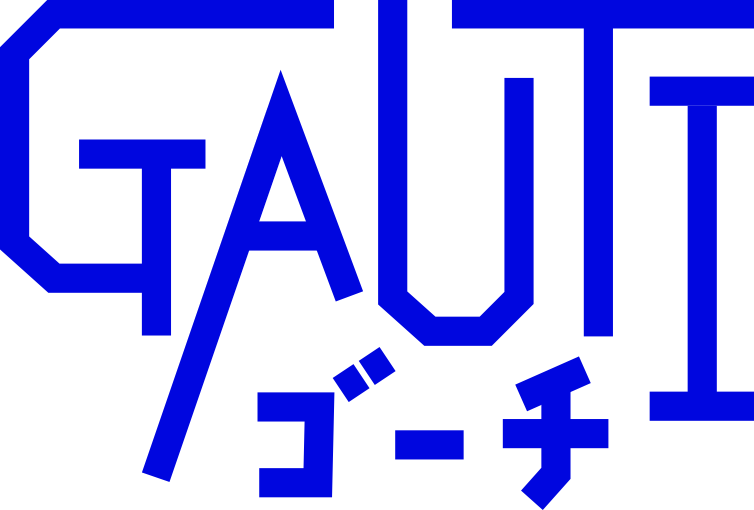

# GAUTIのロゴとマスコットキャラクター「ゴチ」の画像公開用リポジトリ

## 概要  

- このリポジトリは、**GAUTI** のロゴおよびマスコットキャラクター「**ゴチ**」の画像を公開するためのものです。ロゴとキャラクター画像は、CC BY 4.0ライセンスを適用して公開しています。
  -  "GAUTI" は Generative AI Utilization Testing Initiative の略称。日本語名は「生成AI活用検証イニシアティブ」。
  -  "GAUTI" はChatGPTに提案してもらった名前から付けた。プロンプト・出力は [生成AI活用部会名称案](https://gist.github.com/nobucshirai/5f80a5b75eae963985001e2577bf3672) で公開している。

---

## 公開されているファイル

- **GAUTI_logo.pdf**  
  - GAUTIの公式ロゴ画像
  - 

- **gochi_blue.pdf**  
  - マスコットキャラクター「ゴチ」の青色バージョンの画像
  - 

- **gochi_pink.pdf**  
  - マスコットキャラクター「ゴチ」のピンク色バージョンの画像
  - 

- **gochi_yellow.pdf**  
  - マスコットキャラクター「ゴチ」の黄色バージョンの画像
  - 

- **gochi_white.pdf**  
  - マスコットキャラクター「ゴチ」の白色バージョンの画像
  - 

---

## ライセンス

本リポジトリ内のロゴおよびキャラクター画像は以下のライセンスの下で提供されています。  

**[Creative Commons Attribution 4.0 International License (CC BY 4.0)](https://creativecommons.org/licenses/by/4.0/)**  
